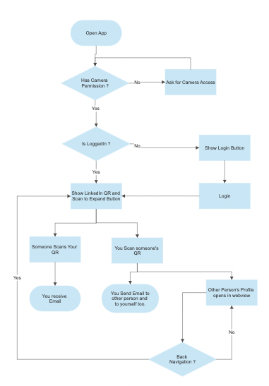

# Welcome to Matrix!

Matrix is an app that lets you do hassle-free networking on **LinkedIn**. Using Matrix, You don't have to search the person manually, Just scan the person's **Matrix QR**.

# Dependencies & Versions

 **Flutter** : 3.0.4^ 
 **Dart** : 2.17.5^ 
[**flutter_inappwebview**: ^5.4.3+7](https://pub.dev/packages/flutter_inappwebview) 
[**qr_flutter**: ^4.0.0  ](https://pub.dev/packages/qr_flutter) 
[**flutter_secure_storage**: ^6.0.0  ](https://pub.dev/packages/flutter_secure_storage) 
[**bloc**: ^8.1.0  ](https://pub.dev/packages/bloc) 
[**flutter_bloc**: ^8.1.1  ](https://pub.dev/packages/flutter_bloc) 
[**equatable**: ^2.0.5](https://pub.dev/packages/equatable) 
[**blur**: ^3.1.0  ](https://pub.dev/packages/blur) 
[**flutter_spinkit**: ^5.1.0  ](https://pub.dev/packages/flutter_spinkit) 
[**qr_code_scanner**: ^1.0.1  ](https://pub.dev/packages/qr_code_scanner) 
[**permission_handler**: ^10.0.1  ](https://pub.dev/packages/permission_handler) 
[**mailer**: ^5.2.0](https://pub.dev/packages/mailer) 
[**path_provider**: ^2.0.11](https://pub.dev/packages/path_provider) 
**Tip:** Use  Bloc extensions in Android App Studio or VS code.

## Core of Matrix App

Matrix runs upon InAppWebView and HeadlessWebView based on Flutter which gives it scalability advantages,
because of usage of javascript injection.

## Nomenclature followed

**Classes and Methods** : PascalCase 
**Variable** : camelCase 
**key and values** : snake_case 

## Pre-requisite

 1. InAppWebView,
 2. DOM manipulation,
 3. Bloc Pattern basics,
 4. Bloc Provider,
 5. Bloc Builder,
 6. Bloc Listener,
 7. Basic UI components <text, color, stack, colomn, row, etc....>,
 8. smtp.
 
 
